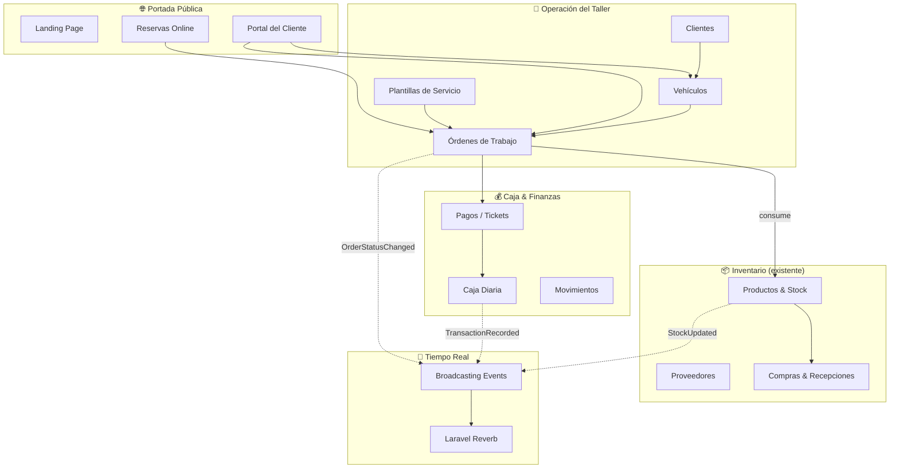
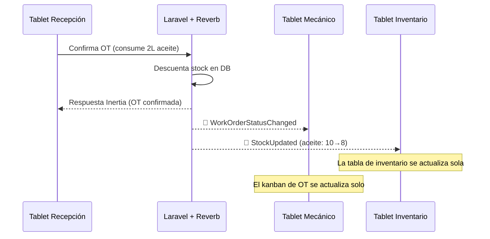

# Plan Maestro — Sistema de Gestión de Taller Fredy Racing

## Contexto

Fredy Racing ya tiene un sistema funcional con Laravel 13 + Inertia v3 + Vue 3 + Tailwind 4 + shadcn-vue sobre **MySQL**. El módulo de **inventario y compras a proveedores** (Fases 0–6) está completado.

La **Fase 7** (reportes de inventario/compras + endurecimiento) está definida en detalle en [`plan.md`](plan.md) y se ejecuta **ahora**, antes de este plan maestro, para cerrar y presentar el módulo de inventario y compras al cliente. Este documento la retoma más adelante como **Fase 13 — Reportes y Dashboard integrales**, que consolida los reportes de todos los módulos nuevos.

Este plan extiende el sistema con los módulos de operación diaria del taller.

---

## Decisiones Confirmadas

| Pregunta | Decisión |
|----------|----------|
| Base de datos | **MySQL** (ya migrado en `.env`) |
| Facturación SUNAT | No por ahora. Solo ticket de pago. API de SUNAT se integra después |
| Acceso de clientes | **Sí**, portal propio con guard separado para ver historial y ser cliente frecuente |
| Notificaciones | Dentro del sistema primero. WhatsApp/Email a futuro |
| Broadcasting | **Sí**, con Laravel Reverb para stock en tiempo real |

---

## User Review Required

> [!IMPORTANT]
> **Nuevos paquetes necesarios (requieren aprobación):**
> - `laravel/reverb` — WebSocket server nativo de Laravel para broadcasting en tiempo real
> - `laravel-echo` + `pusher-js` — Cliente JS para escuchar eventos en el frontend
> - ~~Librería de escaneo de código de barras vía cámara~~ — **hecho**: se instaló
>   `@zxing/library` y ya existe `resources/js/components/BarcodeScanner.vue` (usado en
>   pedidos y recepciones de compra). La Fase 9 lo reutiliza tal cual.
> - Librería de calendario para reservas (evaluar `v-calendar` o DatePicker existente de shadcn)

> [!WARNING]
> **Cambio de ruta raíz:** `GET /` dejará de redirigir a `/login` y mostrará la landing page pública de Fredy Racing con el sistema de reservas.

---

## Open Questions

1. **Capacidad diaria del taller:** ¿Cuántos vehículos pueden atender por turno (mañana/tarde)? Esto define cuántas reservas se permiten por slot.
2. **Guard de clientes:** ¿Los clientes se registran desde la landing con teléfono + contraseña, o reciben un enlace mágico por WhatsApp/email?
3. **Bahías de taller:** ¿Hay bahías/estaciones definidas donde se trabaja cada vehículo, o el mecánico simplemente toma el trabajo?
4. **Impuesto en servicios:** ¿Los servicios de taller llevan IGV (18%) como las compras, o se manejan sin impuesto?

---

## Visión General



---

## Arquitectura de Broadcasting (Tiempo Real)

> Tu ejemplo es perfecto: si el inventario muestra 10 unidades y alguien consume esas 10 en una OT, el otro usuario que tiene la pantalla abierta debe ver 0 **sin refrescar**. Esto se resuelve con broadcasting.

### Stack técnico

| Capa | Tecnología |
|------|-----------|
| WebSocket Server | **Laravel Reverb** (nativo, sin servicios externos) |
| Backend Events | Laravel Broadcasting con `ShouldBroadcast` |
| Frontend Listener | `laravel-echo` + `pusher-js` en Vue 3 |
| Channels | Private channels por módulo |

### Eventos que se transmiten en tiempo real

| Evento | Channel | Cuándo se dispara | Qué datos envía |
|--------|---------|-------------------|----------------|
| `StockUpdated` | `private-inventory` | Al confirmar OT, recibir compra o ajustar stock | `product_id`, `new_stock`, `previous_stock` |
| `WorkOrderStatusChanged` | `private-workshop` | Al crear, confirmar, completar o cancelar OT | `work_order_id`, `status`, `vehicle_info` |
| `CashTransactionRecorded` | `private-cashier` | Al registrar ingreso/egreso en caja | `type`, `amount`, `running_total` |
| `AppointmentCreated` | `private-appointments` | Cuando un cliente reserva desde la portada | `appointment_id`, `date`, `customer_name` |

### Cómo funciona en la práctica



### Archivos de broadcasting

#### [NEW] `app/Events/StockUpdated.php`
Evento que implementa `ShouldBroadcast`. Se dispara desde `AdjustProductStock`, `ReceivePurchaseOrder` y `CreateWorkOrder`.

#### [NEW] `app/Events/WorkOrderStatusChanged.php`
#### [NEW] `app/Events/CashTransactionRecorded.php`
#### [NEW] `app/Events/AppointmentCreated.php`
#### [NEW] `routes/channels.php`
Autorización de canales privados verificando permisos del usuario autenticado.

#### [MODIFY] Frontend — Composable Vue
```
// resources/js/composables/useChannel.ts
// Hook reutilizable que escucha un canal y actualiza props reactivas de Inertia
```

---

## Propuesta de Fases

### Fase 8 — Clientes y Vehículos

**Objetivo:** Base de datos de clientes con sus vehículos, ficha técnica y datos de motor para cálculos de consumo.

> [!NOTE]
> Los permisos `clientes.ver`, `clientes.gestionar`, `vehiculos.ver`, `vehiculos.gestionar` ya están sembrados en `RolePermissionSeeder`. No hay que crearlos, solo usarlos.

#### Modelo de datos

##### `customers` [NEW]
| Campo | Tipo | Nota |
|-------|------|------|
| `id` | bigint PK | |
| `document_type` | enum | DNI, RUC, CE, Pasaporte |
| `document_number` | string, único | |
| `name` | string | Nombre completo o razón social |
| `phone` | string, nullable | Principal — para notificaciones |
| `secondary_phone` | string, nullable | |
| `email` | string, nullable | Para futuro portal y notificaciones |
| `address` | string, nullable | |
| `district` | string, nullable | |
| `notes` | text, nullable | |
| `is_active` | boolean | |
| timestamps | | |

##### `vehicles` [NEW]
| Campo | Tipo | Nota |
|-------|------|------|
| `id` | bigint PK | |
| `customer_id` | FK → customers | |
| `type` | enum | Moto, Auto, Trimóvil, Cuatrimoto, Otro |
| `brand` | string | Honda, Yamaha, Toyota, etc. |
| `model` | string | CBR 250, YZF-R3, Hilux, etc. |
| `year` | smallint, nullable | |
| `plate_number` | string, nullable, único | Placa |
| `color` | string, nullable | |
| `engine_cc` | smallint | Cilindrada: 125, 150, 200, 250, 300+ |
| `engine_number` | string, nullable | |
| `chassis_number` | string, nullable | VIN |
| `current_mileage` | integer, nullable | Kilometraje actual |
| `notes` | text, nullable | |
| timestamps | | |

##### Enums [NEW]
- **`VehicleType`**: `Motorcycle` (Moto), `Car` (Auto), `Trimobile` (Trimóvil), `ATV` (Cuatrimoto), `Other` (Otro)
- **`DocumentType`**: `DNI`, `RUC`, `CE`, `Passport`

#### Pantallas

- **Listado de clientes** (`/clientes`): Búsqueda por nombre/documento/teléfono. Tarjetas en móvil, tabla en desktop. Badge con cantidad de vehículos.
- **Ficha del cliente** (`/clientes/{customer}`): Datos de contacto + lista de vehículos como tarjetas con icono por tipo + historial de servicios (vacío hasta Fase 9).
- **Crear cliente** (`/clientes/crear`): Formulario de 1 sola pantalla. Campos grandes para tablet.
- **Editar cliente** (`/clientes/{customer}/editar`).
- **Vehículos**: Se crean/editan desde la ficha del cliente vía Sheet/Modal lateral. Sin página separada.

#### Archivos

| Tipo | Archivo | Nota |
|------|---------|------|
| Migración | `create_customers_table` | |
| Migración | `create_vehicles_table` | |
| Modelo | `app/Models/Customer.php` | Relación `hasMany(Vehicle)` |
| Modelo | `app/Models/Vehicle.php` | Relación `belongsTo(Customer)`, futuro `hasMany(WorkOrder)` |
| Enum | `app/Enums/VehicleType.php` | |
| Enum | `app/Enums/DocumentType.php` | |
| Controller | `app/Http/Controllers/CustomerController.php` | CRUD resource |
| Controller | `app/Http/Controllers/VehicleController.php` | Nested bajo customer |
| Request | `app/Http/Requests/StoreCustomerRequest.php` | |
| Request | `app/Http/Requests/UpdateCustomerRequest.php` | |
| Request | `app/Http/Requests/StoreVehicleRequest.php` | |
| Request | `app/Http/Requests/UpdateVehicleRequest.php` | |
| Policy | `app/Policies/CustomerPolicy.php` | |
| Policy | `app/Policies/VehiclePolicy.php` | |
| Factory | `database/factories/CustomerFactory.php` | |
| Factory | `database/factories/VehicleFactory.php` | |
| Seeder | `database/seeders/CustomerVehicleSeeder.php` | Datos demo |
| Page | `resources/js/pages/customers/Index.vue` | |
| Page | `resources/js/pages/customers/Show.vue` | Con pestañas: vehículos, historial |
| Page | `resources/js/pages/customers/Create.vue` | |
| Page | `resources/js/pages/customers/Edit.vue` | |
| Component | `resources/js/components/CustomerForm.vue` | |
| Component | `resources/js/components/VehicleForm.vue` | Para Sheet/Modal |
| Modify | `resources/js/components/AppSidebar.vue` | Agregar "Clientes" al nav |

#### Rutas
| URI | Nombre | Método |
|-----|--------|--------|
| `/clientes` | `customers.index` | GET |
| `/clientes/crear` | `customers.create` | GET |
| `/clientes` | `customers.store` | POST |
| `/clientes/{customer}` | `customers.show` | GET |
| `/clientes/{customer}/editar` | `customers.edit` | GET |
| `/clientes/{customer}` | `customers.update` | PUT |
| `/clientes/{customer}/vehiculos` | `customers.vehicles.store` | POST |
| `/clientes/{customer}/vehiculos/{vehicle}` | `customers.vehicles.update` | PUT |
| `/clientes/{customer}/vehiculos/{vehicle}` | `customers.vehicles.destroy` | DELETE |

---

### Fase 9 — Plantillas de Servicio y Órdenes de Trabajo

**Objetivo:** OT vinculadas a un vehículo con cálculo automático de materiales según cilindrada y tipo de servicio. Escáner de código de barras. Wizard de 4 pasos.

#### Cálculo inteligente de cantidades por cilindrada

> Tu ejemplo: "10 galones de aceite para 10 motos 125, 7 para motos 200, 5 para 300"

La fórmula se define en cada plantilla:

```
cantidad_final = base_quantity + ((engine_cc - base_cc) / cc_step_size) × quantity_per_cc_step
```

| Producto | base_quantity (125cc) | quantity_per_cc_step | cc_step_size | Motor 125 | Motor 200 | Motor 300 |
|----------|----------------------|---------------------|-------------|-----------|-----------|-----------|
| Aceite motor | 1.0 L | 0.5 L | 125 | 1.0 L | 1.5 L | 2.0 L |
| Filtro aceite | 1 und | 0 | — | 1 | 1 | 1 |
| Líquido freno | 0.25 L | 0.1 L | 125 | 0.25 L | 0.35 L | 0.45 L |

#### Modelo de datos

##### `service_templates` [NEW]
| Campo | Tipo | Nota |
|-------|------|------|
| `id` | bigint PK | |
| `name` | string | "Mant. preventivo", "Mant. general" |
| `slug` | string, único | |
| `description` | text, nullable | |
| `vehicle_type` | enum, nullable | Nulo = aplica a todos |
| `estimated_duration_minutes` | int | |
| `base_labor_cost` | decimal(10,2) | Mano de obra base |
| `is_active` | boolean | |
| timestamps | | |

##### `service_template_items` [NEW]
| Campo | Tipo | Nota |
|-------|------|------|
| `id` | bigint PK | |
| `service_template_id` | FK | |
| `product_id` | FK → products | |
| `base_quantity` | decimal(10,3) | Cantidad para motor base (125cc) |
| `base_cc` | smallint, default 125 | Cilindrada base de referencia |
| `quantity_per_cc_step` | decimal(10,5), default 0 | Incremento por paso de cc |
| `cc_step_size` | smallint, default 125 | Cada cuántos cc se incrementa |
| `is_required` | boolean, default true | ¿Obligatorio o sugerido? |
| `notes` | string, nullable | |
| timestamps | | |

##### `work_orders` [NEW]
| Campo | Tipo | Nota |
|-------|------|------|
| `id` | bigint PK | |
| `number` | string, único | OT-2026-000001 |
| `vehicle_id` | FK | |
| `customer_id` | FK | Denormalizado |
| `service_template_id` | FK, nullable | Plantilla usada |
| `assigned_to` | FK → users, nullable | Mecánico |
| `created_by` | FK → users | |
| `status` | enum | Borrador → En progreso → Completado → Entregado |
| `priority` | enum | Normal, Urgente |
| `mileage_at_entry` | integer, nullable | |
| `diagnosis` | text, nullable | |
| `customer_notes` | text, nullable | |
| `internal_notes` | text, nullable | |
| `labor_cost` | decimal(10,2) | |
| `materials_cost` | decimal(10,2) | Suma de items |
| `total_cost` | decimal(10,2) | labor + materials |
| `started_at` | datetime, nullable | |
| `completed_at` | datetime, nullable | |
| `delivered_at` | datetime, nullable | |
| timestamps | | |

##### `work_order_items` [NEW]
| Campo | Tipo | Nota |
|-------|------|------|
| `id` | bigint PK | |
| `work_order_id` | FK | |
| `product_id` | FK | |
| `product_name` | string | Copia histórica |
| `product_sku` | string | Copia histórica |
| `quantity` | decimal(10,3) | |
| `unit_cost` | decimal(10,4) | Costo al momento |
| `subtotal` | decimal(10,2) | |
| `is_from_template` | boolean | |
| timestamps | | |

##### Enums [NEW]
- **`WorkOrderStatus`**: `Draft`, `InProgress`, `Completed`, `Delivered`, `Cancelled`
- **`WorkOrderPriority`**: `Normal`, `Urgent`

#### Flujo UX — Wizard de 4 pasos (una sola pantalla, stepper horizontal)

```
┌──────────────────────────────────────────────────┐
│  ① Cliente  →  ② Vehículo  →  ③ Servicio  →  ④ Confirmar  │
└──────────────────────────────────────────────────┘
```

1. **① Cliente**: Campo de búsqueda con autocomplete. Si no existe → mini-formulario inline (nombre + teléfono + DNI). **1 click** para seleccionar existente.
2. **② Vehículo**: Tarjetas grandes del cliente. Si no existe → formulario inline (tipo + marca + modelo + cc + placa). **1 click** para seleccionar.
3. **③ Servicio**: Tarjetas de plantillas. Al seleccionar → auto-calcula cantidades por cc del vehículo. Se puede ajustar. **Botón de escáner 📷** para agregar productos extra por código de barras. Muestra stock disponible en tiempo real.
4. **④ Confirmar**: Resumen total (materiales + mano de obra). Verifica stock. Botón grande "Crear Orden". **1 click**.

#### Descuento de inventario

| Estado OT | Efecto en stock |
|-----------|----------------|
| Borrador | ❌ No toca stock. Solo muestra disponibilidad |
| En progreso | ✅ Descuenta stock (`WorkshopConsumption`) |
| Completado | Sin cambio adicional |
| Entregado | Sin cambio (pago registrado en Caja) |
| Cancelado | 🔄 Devuelve al stock (`Return`) |

Broadcasting: cada cambio de stock dispara `StockUpdated` → todas las tablets ven el nuevo stock sin refrescar.

#### Escáner de código de barras

`resources/js/components/BarcodeScanner.vue` **ya existe** (construido en la fase de compras):
- Diálogo con la cámara trasera (`facingMode: environment`), `@zxing/library` cargado de
  forma diferida sólo al abrir la cámara.
- Emite `@detected="code"` por cada lectura, con anti-rebote de 1,5 s y vibración.
- Maneja permiso denegado, sin cámara y contexto no seguro (requiere HTTPS o localhost).
- Búsqueda del producto: endpoint `GET inventory.products.barcode.lookup` (resuelve por
  `barcode` EAN-13 o por `sku`) más el composable `useProductLookup`.

Para la Fase 9 sólo falta enchufar `@detected` al wizard de OT: **escanear → producto +
stock en vivo → cantidad → agregar**.

#### Archivos principales

| Tipo | Archivo |
|------|---------|
| Modelo | `app/Models/ServiceTemplate.php` |
| Modelo | `app/Models/ServiceTemplateItem.php` |
| Modelo | `app/Models/WorkOrder.php` |
| Modelo | `app/Models/WorkOrderItem.php` |
| Enum | `app/Enums/WorkOrderStatus.php` |
| Enum | `app/Enums/WorkOrderPriority.php` |
| Action | `app/Actions/Workshop/CreateWorkOrder.php` |
| Action | `app/Actions/Workshop/CancelWorkOrder.php` |
| Action | `app/Actions/Workshop/CalculateServiceQuantities.php` |
| Controller | `app/Http/Controllers/WorkOrderController.php` |
| Controller | `app/Http/Controllers/WorkOrderStatusController.php` |
| Controller | `app/Http/Controllers/ServiceTemplateController.php` |
| Event | `app/Events/StockUpdated.php` |
| Event | `app/Events/WorkOrderStatusChanged.php` |
| Page | `resources/js/pages/workshop/Index.vue` |
| Page | `resources/js/pages/workshop/Create.vue` (Wizard) |
| Page | `resources/js/pages/workshop/Show.vue` |
| Page | `resources/js/pages/workshop/Templates.vue` |
| Component | `resources/js/components/WorkOrderWizard.vue` |
| Component | `resources/js/components/BarcodeScanner.vue` |
| Component | `resources/js/components/ServiceCard.vue` |
| Composable | `resources/js/composables/useChannel.ts` |

#### Permisos (ya sembrados)
- `ordenes-trabajo.ver`, `ordenes-trabajo.gestionar`
- Nuevos a agregar: `ordenes-trabajo.cancelar`, `plantillas-servicio.ver`, `plantillas-servicio.gestionar`

---

### Fase 10 — Caja y Pagos

**Objetivo:** Control de caja diario, registro de ingresos/egresos, cobro de OT con ticket de pago (sin SUNAT por ahora).

> **Estado: implementada como tienda el 10 de septiembre de 2026** (antes que las Fases 8–9, a pedido del cliente).
> Se construyó el módulo de **caja + ventas de productos (POS)** sobre el inventario existente:
>
> - `sale_price` en `products` (editable en la ficha y por línea en la venta).
> - Enums `CashRegisterStatus`, `CashTransactionType`, `CashTransactionCategory`, `PaymentMethod`, `SaleStatus`; `InventoryMovementType` sumó `sale` y `sale_return`.
> - Tablas `cash_registers`, `cash_transactions` (inmutable, polimórfica vía `source`), `sales`, `sale_items` (inmutable).
> - Acciones transaccionales: `OpenCashRegister`, `CloseCashRegister` (cuadre esperado vs. contado + diferencia), `RegisterCashTransaction`, `RegisterSale` (descuenta stock + movimientos + ingreso de caja, idempotente), `CancelSale` (repone stock + devolución en caja).
> - Una sola caja abierta a la vez; vender o registrar movimientos exige caja abierta.
> - Permisos `caja.ver|abrir|cerrar|registrar-movimiento`, `ventas.ver|registrar|anular` (Admin y Recepción).
> - Pantallas: `cashier/Index` (caja del día), `cashier/History`, `sales/Index`, `sales/Create` (POS con escáner de cámara y buscador), `sales/Show` (ticket imprimible con `@media print`).
> - Rutas `cashier.*` y `sales.*`; endpoint `sales.products.search` para el POS; el barcode lookup ahora devuelve `sale_price`.
>
> **Pendiente para cuando existan las Fases 8–9:** cobro de una OT completada (`WorkOrderPayment` + categoría `ServicePayment`) y el `PaymentModal` desde el detalle de la OT. El resto de esta sección queda como referencia de ese enganche.

#### Modelo de datos

##### `cash_registers` [NEW]
| Campo | Tipo | Nota |
|-------|------|------|
| `id` | bigint PK | |
| `opened_by` | FK → users | |
| `closed_by` | FK → users, nullable | |
| `opening_amount` | decimal(10,2) | Monto de apertura |
| `expected_closing_amount` | decimal(10,2), nullable | Calculado |
| `actual_closing_amount` | decimal(10,2), nullable | Conteo real |
| `difference` | decimal(10,2), nullable | Sobrante/faltante |
| `opened_at` | datetime | |
| `closed_at` | datetime, nullable | |
| `notes` | text, nullable | |
| timestamps | | |

##### `cash_transactions` [NEW]
| Campo | Tipo | Nota |
|-------|------|------|
| `id` | bigint PK | |
| `cash_register_id` | FK | |
| `user_id` | FK → users | |
| `type` | enum | Ingreso, Egreso |
| `category` | enum | Pago servicio, Venta producto, Compra insumo, Gasto operativo, Otro |
| `amount` | decimal(10,2) | |
| `payment_method` | enum | Efectivo, Yape, Plin, Transferencia, Tarjeta |
| `reference_type` | string, nullable | Polimórfico |
| `reference_id` | bigint, nullable | |
| `description` | string | |
| `occurred_at` | datetime | |
| timestamps | | |

##### `work_order_payments` [NEW]
| Campo | Tipo | Nota |
|-------|------|------|
| `id` | bigint PK | |
| `work_order_id` | FK | |
| `cash_transaction_id` | FK | |
| `amount` | decimal(10,2) | |
| timestamps | | |

##### Enums [NEW]
- **`CashTransactionType`**: `Income` (Ingreso), `Expense` (Egreso)
- **`CashTransactionCategory`**: `ServicePayment`, `ProductSale`, `SupplyPurchase`, `OperatingExpense`, `Other`
- **`PaymentMethod`**: `Cash`, `Yape`, `Plin`, `BankTransfer`, `Card`

#### Flujo de cobro (2 clicks desde OT completada)

1. OT en estado "Completado" → botón grande **"Cobrar"**.
2. Modal muestra total. Seleccionar método (Efectivo/Yape/Plin/Tarjeta/Transferencia). Admite pago parcial (adelanto).
3. Click en "Registrar pago" → Se crea `CashTransaction` + `WorkOrderPayment` + OT pasa a "Entregado" (si pago completo).
4. Se genera ticket de pago imprimible/descargable.

#### Ticket de pago (sin SUNAT)

Documento interno con:
- Número correlativo (TK-2026-000001)
- Datos del taller (Fredy Racing)
- Datos del cliente
- Detalle: materiales + mano de obra
- Total y método de pago
- Fecha y hora
- Vista imprimible con `@media print`

#### Pantallas

- **Caja del día** (`/caja`): Apertura → resumen del día (ingresos/egresos por categoría y método) → lista de movimientos → cierre con conteo.
- **Historial de caja** (`/caja/historial`): Cajas cerradas con resúmenes.
- **Cobrar OT**: Modal desde `/taller/{workOrder}`.
- **Registrar gasto**: Botón rápido en la caja para egresos (compras, gastos operativos).

Broadcasting: `CashTransactionRecorded` se transmite → si recepción tiene la caja abierta en otra pestaña, se actualiza en vivo.

#### Archivos principales

| Tipo | Archivo |
|------|---------|
| Modelo | `app/Models/CashRegister.php` |
| Modelo | `app/Models/CashTransaction.php` |
| Modelo | `app/Models/WorkOrderPayment.php` |
| Enums | `CashTransactionType`, `CashTransactionCategory`, `PaymentMethod` |
| Action | `app/Actions/Cashier/OpenCashRegister.php` |
| Action | `app/Actions/Cashier/CloseCashRegister.php` |
| Action | `app/Actions/Cashier/RegisterPayment.php` (transaccional) |
| Controller | `app/Http/Controllers/CashRegisterController.php` |
| Controller | `app/Http/Controllers/CashTransactionController.php` |
| Controller | `app/Http/Controllers/WorkOrderPaymentController.php` |
| Event | `app/Events/CashTransactionRecorded.php` |
| Page | `resources/js/pages/cashier/Index.vue` |
| Page | `resources/js/pages/cashier/History.vue` |
| Component | `resources/js/components/PaymentModal.vue` |
| Component | `resources/js/components/CashSummaryCard.vue` |
| Component | `resources/js/components/PaymentTicket.vue` |

#### Permisos [NEW]
- `caja.ver`, `caja.abrir`, `caja.cerrar`, `caja.registrar-movimiento`

---

### Fase 11 — Reservas Online y Portada Pública

**Objetivo:** Landing page pública con calendario de disponibilidad y formulario de reserva. Panel interno para gestionar citas.

> **Adelanto (10 de septiembre de 2026):** la **página de login** ya es una landing pública
> de una sola página con scroll (`resources/js/pages/auth/Login.vue`, layout `BlankLayout`):
> barra de anuncios, hero con el formulario de acceso integrado, servicios, ofertas con
> precios, manifiesto, proceso, el taller, reseñas, contacto y footer. Responsive de 360 px
> a escritorio, **modo claro/oscuro completo** (usa los tokens `background`/`card`/`muted`/
> `foreground` y un botón de tema en la barra), contadores animados, marquesinas y botón
> flotante de WhatsApp. Datos reales: Carretera Central paradero 15 – Huánuco, teléfonos
> 930 955 836 y 902 465 531. `GET /` sigue redirigiendo a `/login`.
> **Falta de esta fase:** modelo `appointments`, el calendario de disponibilidad, el
> formulario de reserva real y el panel `/reservas`. La landing actual ya sirve de base
> visual para cuando `GET /` pase a ser la portada con reservas.

#### Modelo de datos

##### `appointments` [NEW]
| Campo | Tipo | Nota |
|-------|------|------|
| `id` | bigint PK | |
| `customer_id` | FK, nullable | Si ya es cliente |
| `customer_name` | string | |
| `customer_phone` | string | |
| `customer_email` | string, nullable | |
| `vehicle_type` | enum | |
| `vehicle_description` | string | "Honda CB 125 - roja" |
| `service_type` | string | Texto libre o referencia a template |
| `preferred_date` | date | |
| `preferred_time_slot` | enum | Mañana / Tarde |
| `status` | enum | Pendiente, Confirmada, Cancelada, Completada |
| `internal_notes` | text, nullable | |
| `confirmed_at` | datetime, nullable | |
| `work_order_id` | FK, nullable | OT generada al confirmar |
| timestamps | | |

##### Enums [NEW]
- **`AppointmentStatus`**: `Pending`, `Confirmed`, `Cancelled`, `Completed`
- **`TimeSlot`**: `Morning` (8:00–12:00), `Afternoon` (12:00–17:00)

#### Landing page pública (`/`)

```
┌─────────────────────────────────────────────┐
│  🏍️ FREDY RACING                            │
│  Tu taller de confianza                     │
│                                             │
│  [Servicios que ofrecemos]                  │
│  • Mantenimiento preventivo                 │
│  • Mantenimiento general                    │
│  • Reparaciones                             │
│                                             │
│  📅 RESERVA TU CITA                         │
│  ┌─────────────────────────┐               │
│  │ Calendario interactivo  │               │
│  │ 🟢 Disponible           │               │
│  │ 🟡 Pocos cupos          │               │
│  │ 🔴 Lleno                │               │
│  └─────────────────────────┘               │
│  [Nombre] [Teléfono]                       │
│  [Tipo vehículo ▼] [Descripción]           │
│  [Servicio deseado]                        │
│  [ RESERVAR ]                              │
│                                             │
│  📍 Ubicación  📞 Contacto                  │
└─────────────────────────────────────────────┘
```

Sin sidebar, layout público separado. Diseño mobile-first. Rate limiting en el formulario.

#### Panel interno (`/reservas`)

Lista de reservas por fecha con filtros. Acciones:
- **Confirmar** → Notifica al cliente (futuro: WhatsApp).
- **Cancelar** → Con motivo.
- **Convertir a OT** → Pre-carga datos del cliente y vehículo en el wizard de OT.

Broadcasting: `AppointmentCreated` → recepción ve la nueva reserva en tiempo real.

#### Archivos principales

| Tipo | Archivo |
|------|---------|
| Modelo | `app/Models/Appointment.php` |
| Enums | `AppointmentStatus`, `TimeSlot` |
| Controller | `app/Http/Controllers/Public/LandingController.php` (sin auth) |
| Controller | `app/Http/Controllers/Public/AppointmentController.php` (sin auth) |
| Controller | `app/Http/Controllers/AppointmentManagementController.php` (con auth) |
| Event | `app/Events/AppointmentCreated.php` |
| Page | `resources/js/pages/public/Landing.vue` |
| Page | `resources/js/pages/public/AppointmentSuccess.vue` |
| Page | `resources/js/pages/appointments/Index.vue` |
| Layout | `resources/js/layouts/PublicLayout.vue` |
| Modify | `routes/web.php` — `GET /` → LandingController |

#### Permisos [NEW]
- `reservas.ver`, `reservas.gestionar`

---

### Fase 12 — Notificaciones Inteligentes y Portal del Cliente

**Objetivo:** Sistema de notificaciones internas con lógica inteligente. Portal de cliente para ver historial de vehículos.

#### Notificaciones inteligentes (MVP interno)

| Tipo | Lógica | Ejemplo |
|------|--------|---------|
| Estado OT | Al cambiar estado de OT | "Tu moto ya está lista para recoger" |
| Disponibilidad | Al recibir stock de un producto → buscar clientes con vehículos compatibles que no tienen servicio reciente | "Tenemos aceite para tu moto 125cc" |
| Recordatorio | Basado en último servicio + km estimado | "Han pasado 3 meses desde tu último mantenimiento" |

##### `customer_notifications` [NEW]
| Campo | Tipo | Nota |
|-------|------|------|
| `id` | bigint PK | |
| `customer_id` | FK | |
| `type` | enum | `StatusUpdate`, `Availability`, `Reminder` |
| `channel` | enum | `System`, `WhatsApp`, `Email` |
| `title` | string | |
| `message` | text | |
| `sent_at` | datetime, nullable | |
| `read_at` | datetime, nullable | |
| `data` | json, nullable | |
| timestamps | | |

#### Portal del cliente (Fase 12b)

Acceso separado (guard `customer`) donde el cliente ve:
- Sus vehículos y servicios realizados.
- Historial de pagos.
- Estado de OT activa.
- Próximo mantenimiento sugerido.

---

### Fase 13 — Reportes y Dashboard integrales

Parte de la **Fase 7** ya entregada (reportes de compras, consumo y reposición; ver [`plan.md`](plan.md)) y la extiende con los nuevos módulos:

| Reporte | Contenido |
|---------|-----------|
| Dashboard KPIs | OT activas, vehículos en taller, ingresos hoy/mes, servicios completados |
| Ventas/Servicios | Ingresos por tipo, mecánico, periodo |
| Consumo materiales | Productos más usados, rotación, cobertura |
| Reposición | Stock bajo/agotado con sugerencia |
| Clientes | Top clientes frecuentes, vehículos por tipo |
| Caja | Resumen diario/mensual, métodos de pago |

---

## Principios de UX

### Tablet-First
- Botones mínimo 44×44px, touch-friendly.
- Stepper horizontal para wizards (no páginas separadas).
- Bottom action bar en móvil para acciones principales.
- Máximo **4 pasos** para cualquier operación.

### Escáner de Código de Barras
- Usa cámara trasera de la tablet.
- Al escanear SKU → busca producto → muestra nombre + stock + campo cantidad.
- Flujo: **escanear → ingresar cantidad → agregar → siguiente**.

### Responsive
| Dispositivo | Comportamiento |
|-------------|---------------|
| Móvil (<640px) | Tarjetas apiladas, menú hamburguesa, 1 columna |
| Tablet (640–1024px) | Grid 2 cols, sidebar colapsable, wizard optimizado |
| Desktop (>1024px) | Tablas, panel lateral, sidebar expandida |

---

## Orden de Ejecución

| # | Fase | Depende de | Esfuerzo |
|---|------|-----------|----------|
| 1 | **Fase 8**: Clientes y Vehículos | — | Medio |
| 2 | **Fase 9**: Plantillas + OT + Escáner + Broadcasting | Fase 8 | Alto |
| 3 | **Fase 10**: Caja y Pagos + Ticket | Fase 9 | Medio — ✅ tienda hecha, falta cobro de OT |
| 4 | **Fase 11**: Landing + Reservas | Fase 8 | Medio |
| 5 | **Fase 12**: Notificaciones + Portal Cliente | Fases 8–9 | Medio |
| 6 | **Fase 13**: Reportes y Dashboard integrales | Fases 8–10 | Medio |

> La **Fase 7** (reportes de inventario/compras + endurecimiento) va **antes** de esta tabla: cierra el módulo actual para la presentación al cliente. Detalle en [`plan.md`](plan.md).

---

## Verificación

### Tests automáticos (por fase)
- Feature tests CRUD (clientes, vehículos, OT, caja, reservas).
- Tests transaccionales de descuento/devolución de inventario en OT.
- Tests de cálculo automático de cantidades por cilindrada.
- Tests de permisos (403 sin permiso).
- Tests de flujo de pago y cierre de caja.
- Tests de broadcasting events dispatch.
- `php artisan test --compact`, `vendor/bin/pint --dirty --format agent`.

### Verificación manual
- Crear OT en 4 clicks en tablet.
- Escáner de código de barras funcional en tablet/celular.
- Landing page responsive en móvil.
- Broadcasting: abrir 2 pestañas, confirmar OT en una → ver stock actualizado en la otra.
- Responsive: 360px, 768px, 1440px.
